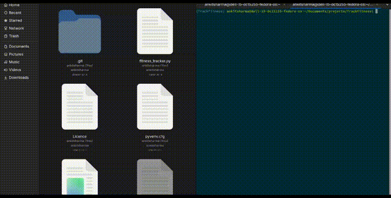

# DevAutoGen



## V0.1

The following languages support added for file generation:

- C
- C++
- Java

## About

Auto-generates:

- Dockerfile
- docker-compose.yml
- Kubernetes deployment & service
- GitHub Actions CI

## Usage

Copy this project directory to your main project directory:
Run

```bash
python main.py
```

You have to manually modify the files generated for you projects requirements to deploy, these files only are the templates.
